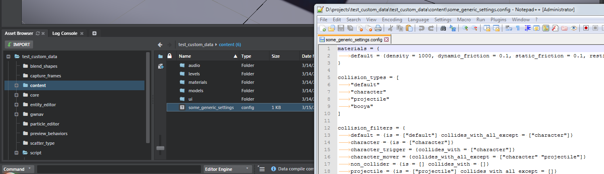
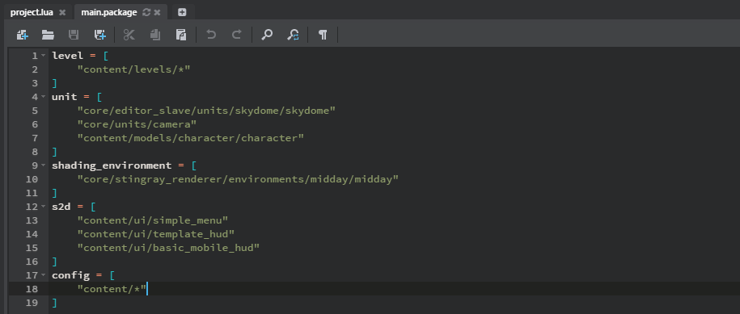

# stingray-easy-config

This Stingray plug-in gives your runtime Lua scripts a way to access generic SJSON configuration data that you save in the project.

## Install

1.	Download the latest release from the [Releases](/bbor/stingray-easy-config/releases) tab of this repo, and extract it to disk.

	Alternatively, get a clone of this repo and run `make.rb` to build its binaries from scratch.

2.	Open the Stingray Editor, and go to the **Plugin Manager** (Ctrl+Shift+K).

3.	Click **Add Plugin**, browse to the `plugin` folder, and select the `easy-config.stingray_plugin` file.

## Use

1.	Create some SJSON or plain JSON data files in your project, and save them with the *.config* extension.

	Here's an example, saved in a project's *content* folder. This example uses some old physics config data, but the data could be anything -- there's no expected variables or objects, you can structure it anyhow that makes sense for the data you need.

	

2.	Make sure you add your *.config* resources to your resource packages, if needed, so that they'll be loaded at runtime.

	

3.	In your Lua scripts, you can now access your configs as Lua tables:

	```lua
	-- check that the data file you want has been loaded
	local data_is_loaded = stingray.EasyConfig.has_data("content/some_generic_settings")

	if data_is_loaded then
	    -- get the contents of the file in a table
	    local my_data_table = stingray.EasyConfig.get_data("content/some_generic_settings")

	    -- work with the data as you would any Lua table.
		-- the keys are the same as the keys in the file.
	    for k, v in pairs(my_data_table.collision_filters.character_mover.collides_with_all_except) do
	        print("value: " .. tostring(v))
	    end
	end
	```

## Details

Internally, the Stingray engine already has support for compiling and loading *.config* files expressed in SJSON and JSON. But there hasn't been a way (until now) of easily accessing the data in those files from Lua.

So this plug-in just adds an API to the runtime Lua environment to get *.config* resources you ask for from the resource management system, and return them as a Lua table.

This gives you a quick and dirty end-to-end way to use free-form data (perhaps generated through some external toolchain) in your project.

In the longer term, if you find yourself repeatedly using data with a consistent format, you might want to investigate creating your own plug-in to handle compiling your own format specifically. This would let you validate at compile time that required fields are present, and that values are in the ranges you expect. It would also let you make your data type a dependency for other data types that may be related, like levels or units -- this would mean that you wouldn't have to include your resource type explicitly in resource packages, because they'll get bundled up along with the level or unit that uses them.
